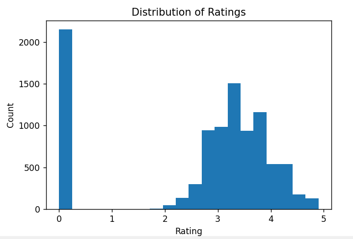
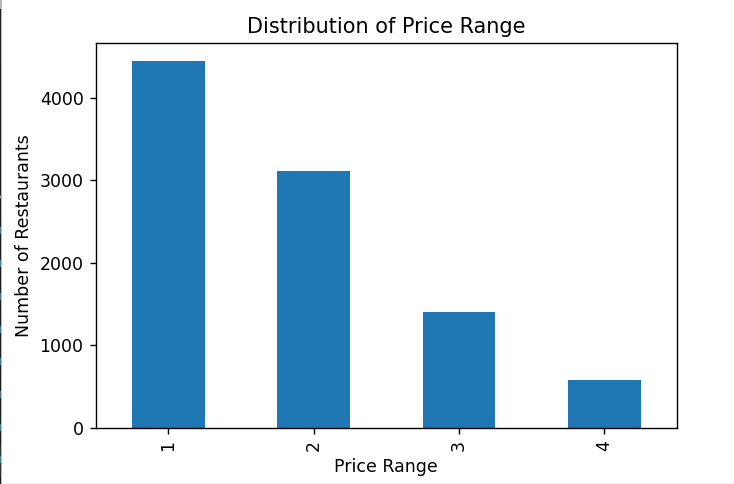
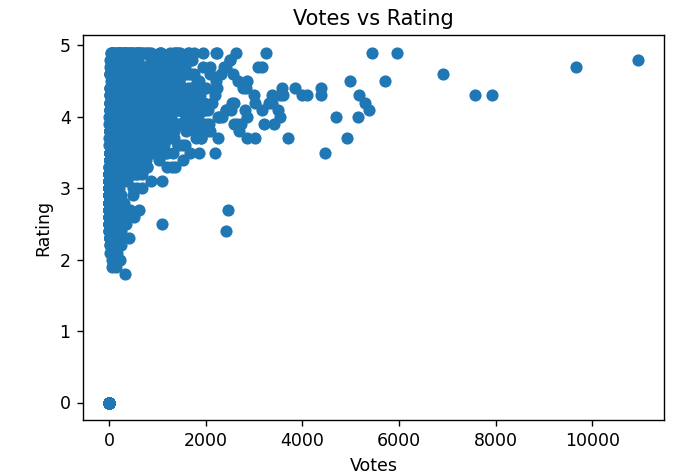
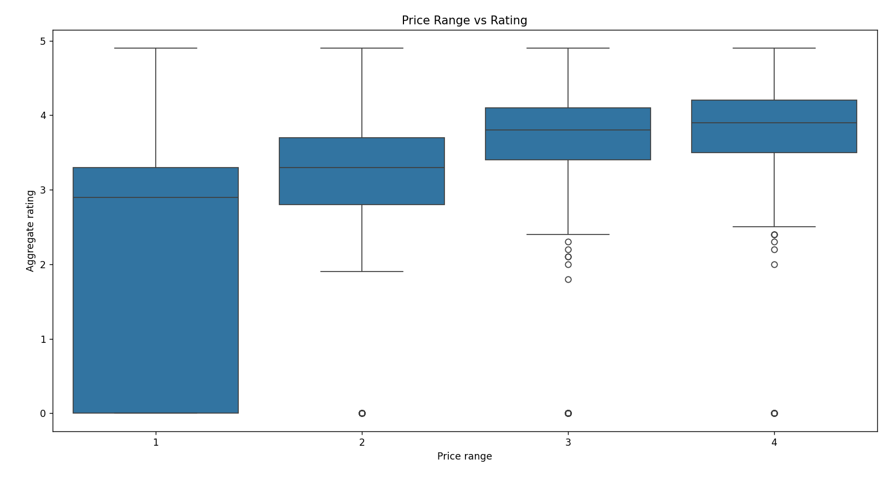

# Data Science Internship Project

## 📌 Overview
This repository contains my work from a Data Science Internship.

## 📊 Work Done
- Data Cleaning & Preprocessing
- Data Analysis & Visualization
- Machine Learning Models

## 🤖 Models Used
- Linear Regression
- Decision Tree
- Random Forest

## 📁 Files Included
- Python Code
- Level 1, 2, 3 Reports

📊 Visualizations

## 🙋‍♂️ Author
BIMAN SHIL

## ▶️ How to Run
=>Install required libraries: 
pip install pandas matplotlib seaborn scikit-learn
=>Run the Python file: python code/analysis.py
